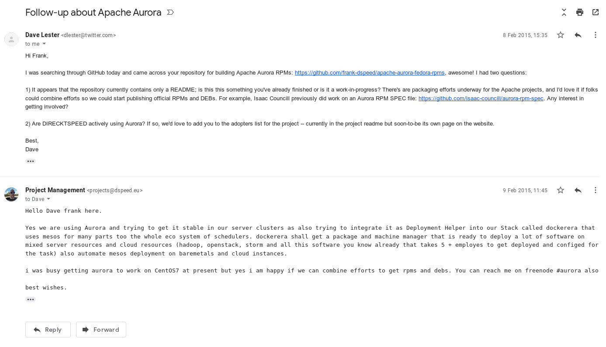

# aurora-fedora
Fedora packaging for Apache Aurora now offical [@apache/aurora-packaging](https://github.com/apache/aurora-packaging)

# Archived
was Moved Permently to but DIREKTSPEED-LTD Got Deprecated
[https://github.com/DIREKTSPEED-LTD/aurora-fedora](https://github.com/DIREKTSPEED-LTD/aurora-fedora)

# Fedora21 (Java 1.8)
python 2.7.8 current fedora package
run docker fedora:rawhid
download aurora incubator current
adjust source for usage of java 1.8 gradl
make all valid for rpm build with restricted user
build it export builded package to /target or maybe volume bind to RPMS or build dir

# CentOS7 (Java 1.7 + 1.8)
python27 package aviable

